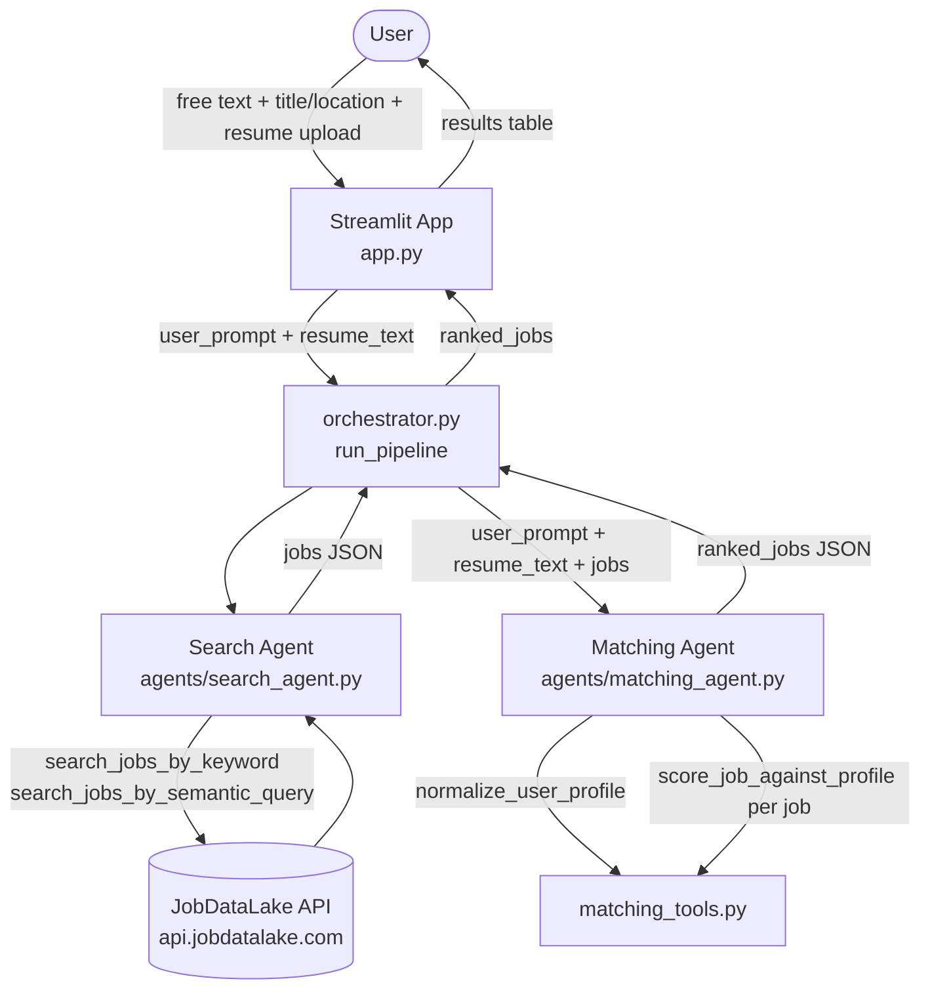

# ai-job-finder

A small two-agent AI system that searches [JobDataLake](https://www.jobdatalake.com/)
for jobs matching a free-text request, then ranks the results against the
candidate's profile (and optional resume).

## How it works

1. The user enters a free-text prompt (plus optional job title, location, and
   resume) in the Streamlit app.
2. The **Search Agent** turns the prompt into JobDataLake API queries and
   returns matching job listings.
3. The **Matching Agent** builds a candidate profile (from the prompt and
   resume) and scores each job 0-100 against it.
4. Ranked results are displayed in the Streamlit app.

## Architecture



## Setup

```bash
pip install -r requirements.txt
cp .env.example .env  # then fill in GEMINI_API_KEY and JOBDATALAKE_API_KEY
streamlit run app.py
```

## Project layout

- `app.py` — Streamlit UI (single Job Search page)
- `orchestrator.py` — runs the Search Agent then the Matching Agent
- `agents/` — agent system prompts, tool schemas, and tool-use loop
- `tools/` — tool implementations (JobDataLake client, search, matching, resume parsing)
- `docs/retrospective_template.md` — "what worked / what didn't" template for test runs
- `tests/` — manual test plan and sample prompts
