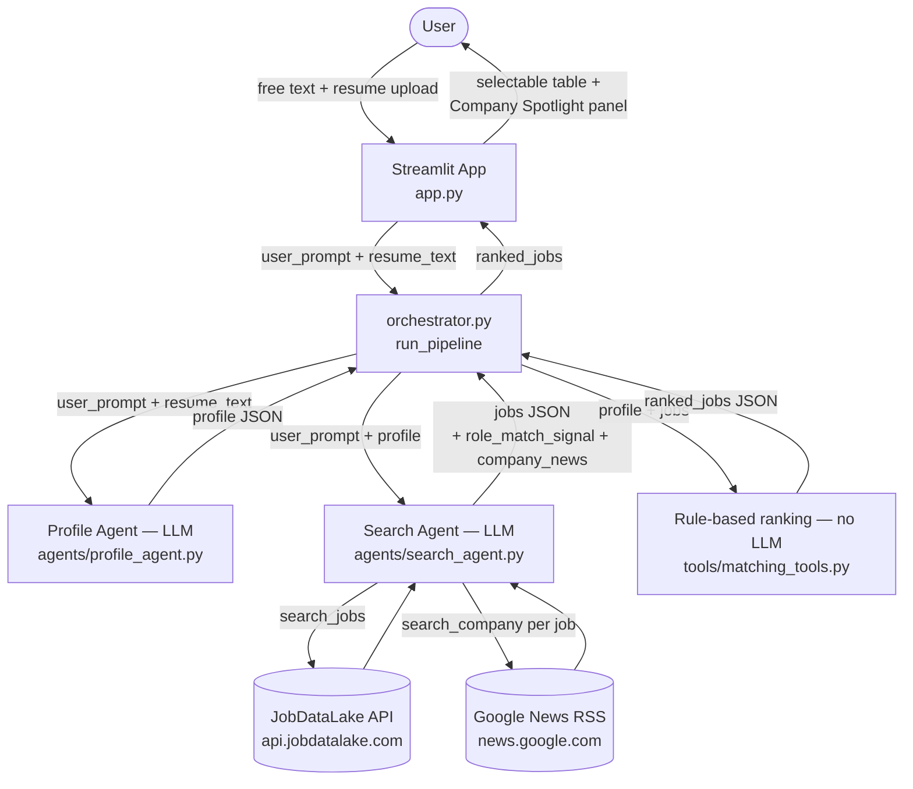

# ai-job-finder

A small AI-assisted system that searches [JobDataLake](https://www.jobdatalake.com/)
for jobs matching a free-text request, then ranks the results against the
candidate's profile (and optional resume).

## How it works

1. The user enters a free-text prompt (plus an optional resume) in the
   Streamlit app.
2. The **Profile Agent** (`agents/profile_agent.py`) extracts a candidate
   profile (role, location, seniority, remote preference, years of
   experience, skills) from the prompt and resume up front, via an LLM call
   — resumes are too free-form for regex to parse reliably. Falls back to a
   deterministic regex extractor (`tools/matching_tools.normalize_user_profile`)
   if the LLM call fails.
3. The **Search Agent** (`agents/search_agent.py`) turns the prompt
   (enriched with the extracted profile) into a JobDataLake API query and
   returns matching job listings (up to 5). For each job it also:
   - estimates a `role_match_signal` (0-1) for how closely the job's title
     matches the candidate's desired role, judged directly from context it
     already has — not a separate tool call.
   - looks up the company via Google News (`tools/google_news_client.py`,
     `search_company`), surfacing up to 3 recent (within 2 years), genuinely
     notable headlines as `company_news`. The agent judges relevance itself
     (many headlines are noise or about an unrelated same-named company) and
     disambiguates using the job's location and, when it can confidently
     identify the company's own domain from the job URL, that domain too.
4. A deterministic rule-based ranking step (`tools/matching_tools.py`)
   scores each job 0-100 against the already-extracted profile — no LLM
   call is involved here, since scoring itself is a fixed formula with no
   actual decision for an LLM to make. It uses the Search Agent's
   `role_match_signal` as a partial-credit fallback when the job title
   isn't an exact substring match for the desired role.
5. Ranked results are shown in a selectable table in the Streamlit app;
   clicking a row opens a "Company Spotlight" panel with that job's dated
   `company_news` headlines.

## Architecture



## Setup

```bash
pip install -r requirements.txt
cp .env.example .env  # then fill in GEMINI_API_KEY and JOBDATALAKE_API_KEY
streamlit run app.py
```

The LLM backend (`gemini` or `groq`) is a deployment-time choice, not a
per-search UI option - set it via the `LLM_PROVIDER` env var (defaults to
`gemini`), e.g. `LLM_PROVIDER=groq streamlit run app.py`.

Company news lookups use Google News' public RSS feed
(`tools/google_news_client.py`) - no API key required, but it's an
unofficial endpoint (scraped/parsed, not a stable contract), so it can
break or get rate-limited if Google changes the feed format.

## Project layout

- `app.py` — Streamlit UI (single Job Search page; selectable results table + Company Spotlight panel)
- `orchestrator.py` — runs the Profile Agent, then the Search Agent, then ranks jobs via deterministic scoring (`tools/matching_tools.py`)
- `agents/` — Profile Agent and Search Agent system prompts/tool schemas, and the shared tool-use loop (`agent_loop.py`)
- `tools/` — tool implementations (JobDataLake client, Google News client, search, matching, resume parsing)
- `docs/retrospective_template.md` — "what worked / what didn't" template for test runs
- `tests/` — manual test plan and sample prompts
