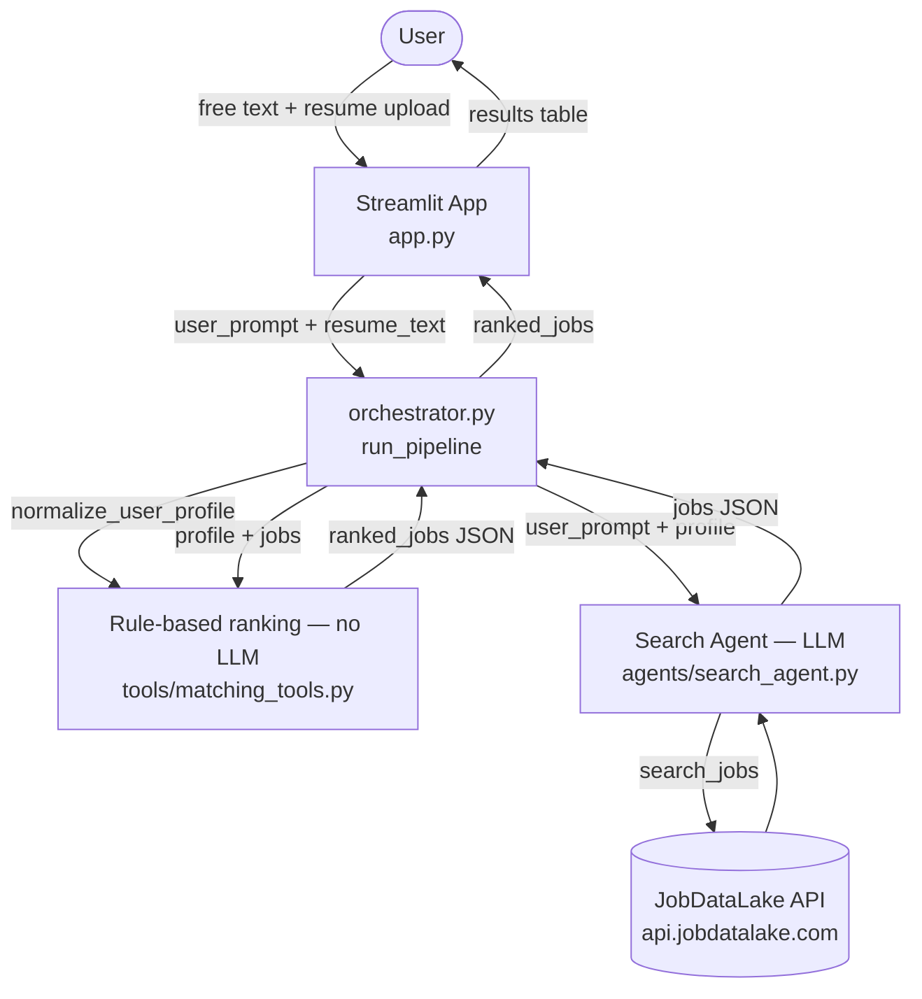

# ai-job-finder

A small AI-assisted system that searches [JobDataLake](https://www.jobdatalake.com/)
for jobs matching a free-text request, then ranks the results against the
candidate's profile (and optional resume).

## How it works

1. The user enters a free-text prompt (plus an optional resume) in the
   Streamlit app.
2. `orchestrator.py` parses a candidate profile (role, location, seniority,
   remote preference, years of experience, skills) from the prompt and
   resume up front, deterministically — no LLM ever sees the raw resume
   text.
3. The **Search Agent** turns the prompt (enriched with profile facts like
   skills found only in the resume) into JobDataLake API queries and returns
   matching job listings.
4. A deterministic rule-based ranking step (`tools/matching_tools.py`)
   scores each job 0-100 against the already-extracted profile — no LLM
   call is involved, since this step is a fixed sequence with no actual
   decision for an LLM to make.
5. Ranked results are displayed in the Streamlit app.

## Architecture



## Setup

```bash
pip install -r requirements.txt
cp .env.example .env  # then fill in GEMINI_API_KEY and JOBDATALAKE_API_KEY
streamlit run app.py
```

The LLM backend (`gemini` or `groq`) is a deployment-time choice, not a
per-search UI option - set it via the `LLM_PROVIDER` env var (defaults to
`gemini`), e.g. `LLM_PROVIDER=groq streamlit run app.py`.

## Project layout

- `app.py` — Streamlit UI (single Job Search page)
- `orchestrator.py` — parses the candidate profile, runs the Search Agent, then ranks jobs via deterministic scoring (`tools/matching_tools.py`)
- `agents/` — Search Agent system prompt/tool schemas and the shared tool-use loop
- `tools/` — tool implementations (JobDataLake client, search, matching, resume parsing)
- `docs/retrospective_template.md` — "what worked / what didn't" template for test runs
- `tests/` — manual test plan and sample prompts
